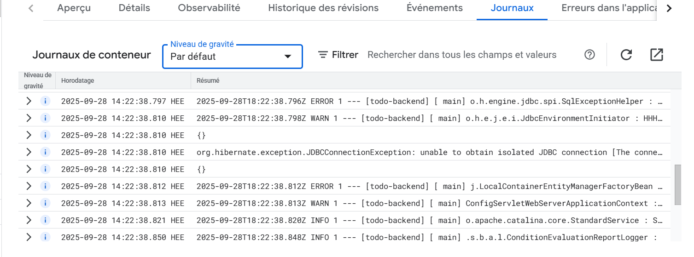

# KubernetesSubmissions

## Configurations repository

[Tdod App project configuration repository](https://github.com/Wilky2/KubernetesConfigurations/tree/prod)

## Exercises

### Chapter 2

- [1.1.](https://github.com/Wilky2/KubernetesSubmissions/tree/1.1/log-output-app)
- [1.2.](https://github.com/Wilky2/KubernetesSubmissions/tree/1.2/todo-app-web-server)
- [1.3.](https://github.com/Wilky2/KubernetesSubmissions/tree/1.3/log-output-app)
- [1.4.](https://github.com/Wilky2/KubernetesSubmissions/tree/1.4/todo-app-web-server)
- [1.5.](https://github.com/Wilky2/KubernetesSubmissions/tree/1.5/todo-app-web-server)
- [1.6.](https://github.com/Wilky2/KubernetesSubmissions/tree/1.6/todo-app-web-server)
- [1.7.](https://github.com/Wilky2/KubernetesSubmissions/tree/1.7/log-output-app)
- [1.8.](https://github.com/Wilky2/KubernetesSubmissions/tree/1.8/todo-app-web-server)
- [1.9.](https://github.com/Wilky2/KubernetesSubmissions/tree/1.9/ping-pong-app)
- [1.10.](https://github.com/Wilky2/KubernetesSubmissions/tree/1.10/logoutput)
- [1.11.](https://github.com/Wilky2/KubernetesSubmissions/tree/1.11/logoutput)
- [1.12.](https://github.com/Wilky2/KubernetesSubmissions/tree/1.12/todo-app-web-server)
- [1.13.](https://github.com/Wilky2/KubernetesSubmissions/tree/1.13/todo-app-web-server)

### Chapter 3

- [2.1.](https://github.com/Wilky2/KubernetesSubmissions/tree/2.1/logoutput)
- [2.2.](https://github.com/Wilky2/KubernetesSubmissions/tree/2.2/todo-app)
- [2.3.](https://github.com/Wilky2/KubernetesSubmissions/tree/2.3/logoutput)
- [2.4.](https://github.com/Wilky2/KubernetesSubmissions/tree/2.4/todo-app)
- [2.5.](https://github.com/Wilky2/KubernetesSubmissions/tree/2.5/logoutput)
- [2.6.](https://github.com/Wilky2/KubernetesSubmissions/tree/2.6/todo-app)
- [2.7.](https://github.com/Wilky2/KubernetesSubmissions/tree/2.7/logoutput)
- [2.8.](https://github.com/Wilky2/KubernetesSubmissions/tree/2.8/todo-app)
- [2.9.](https://github.com/Wilky2/KubernetesSubmissions/tree/2.9/todo-app/todo-backend/manifests)
- [2.10.](https://github.com/Wilky2/KubernetesSubmissions/tree/2.10/todo-app/todo-backend)

### Chapter 4

- [3.1.](https://github.com/Wilky2/KubernetesSubmissions/tree/3.1/logoutput)
- [3.2.](https://github.com/Wilky2/KubernetesSubmissions/tree/3.2/logoutput)
- [3.3.](https://github.com/Wilky2/KubernetesSubmissions/tree/3.3/logoutput)
- [3.4.](https://github.com/Wilky2/KubernetesSubmissions/tree/3.4/logoutput)
- [3.5.](https://github.com/Wilky2/KubernetesSubmissions/tree/3.5/todo-app)
#### Exercise 3.6 solution
- [3.6.-workflow](https://github.com/Wilky2/KubernetesSubmissions/tree/3.6/.github/workflows)
- [3.6.-todo-app](https://github.com/Wilky2/KubernetesSubmissions/tree/3.6/todo-app)
#### Exercise 3.7 solution
- [3.7.-workflow](https://github.com/Wilky2/KubernetesSubmissions/tree/3.7/.github/workflows)
- [3.7.-todo-app](https://github.com/Wilky2/KubernetesSubmissions/tree/3.7/todo-app)

- [3.8.-workflow](https://github.com/Wilky2/KubernetesSubmissions/tree/3.8/.github/workflows)

#### Exercise 3.9 solution

##### **DBaaS (Google Cloud SQL)**

###### Pros

* **Ease of initialization**:

    * Quick to set up with Google Console or `gcloud` commands.
    * No need to containerize or manage database images.

* **Fully managed operations**:

    * Google handles upgrades, patching, failover, scaling, and security hardening.
    * Automatic storage scaling.

* **Backups**:

    * Built-in automated daily backups and point-in-time recovery.
    * Easy to restore with a few clicks/commands.

* **Reliability**:

    * High availability (multi-zone replicas).
    * SLA-backed uptime.

* **Security & networking**:

    * Integrated IAM roles, VPC peering, private IP, SSL/TLS by default.

###### Cons

* **Cost**:

    * Typically higher than running your own DB (compute + storage + backups + network egress).
    * You pay for uptime, even if the database is idle.

* **Less flexibility**:

    * You cannot customize the PostgreSQL engine as much (extensions, tuning at OS level).
    * Limited choice of versions compared to community PostgreSQL.

* **Networking setup**:

    * Access from GKE requires configuring VPC peering or Cloud SQL Proxy.

---

##### **Self-managed PostgreSQL on GKE with PVCs**

###### Pros

* **Cost flexibility**:

    * Cheaper, since you just pay for GKE compute + storage (Persistent Disks).
    * Can scale resources to exactly what you need.

* **Flexibility**:

    * Full control over PostgreSQL configuration and extensions.
    * Can run on the same cluster as your app for lower latency.

* **No vendor lock-in**:

    * Standard PostgreSQL container images, easily portable.

###### Cons

* **Initialization work**:

    * You need to deploy StatefulSets, Services, PVCs, configure readiness/liveness probes.
    * More YAML to maintain.

* **Maintenance burden**:

    * You’re responsible for patching, upgrading Postgres images, ensuring high availability.
    * Scaling is manual (increase replicas, manage leader election, etc.).

* **Backups**:

    * Not automatic. You must configure tools like `pg_dump`, `pg_basebackup`, Velero, or CSI snapshots.
    * Restores are manual and more error-prone compared to Cloud SQL.

* **Reliability**:

    * PersistentVolumeClaims are tied to specific zones.
    * HA requires setting up replication manually (Patroni, Stolon, or Helm charts).

- [3.10.](https://github.com/Wilky2/KubernetesSubmissions/tree/3.10/todo-app/postgres-db)
- [3.11.](https://github.com/Wilky2/KubernetesSubmissions/tree/3.11/todo-app)

#### Exercise 3.12 solution



### Chapter 5

- [4.1.](https://github.com/Wilky2/KubernetesSubmissions/tree/4.1/logoutput)
- [4.2.](https://github.com/Wilky2/KubernetesSubmissions/tree/4.2/todo-app)

#### Exercise 4.3 solution

```promql
sum(
  kube_pod_info{namespace="prometheus", created_by_kind="StatefulSet"}
)
```

- [4.4.](https://github.com/Wilky2/KubernetesSubmissions/tree/4.4/logoutput)
- [4.5.](https://github.com/Wilky2/KubernetesSubmissions/tree/4.5/todo-app)
- [4.6.](https://github.com/Wilky2/KubernetesSubmissions/tree/4.6/todo-app)
- [4.7.](https://github.com/Wilky2/KubernetesSubmissions/tree/4.7/logoutput)
- [4.8.](https://github.com/Wilky2/KubernetesSubmissions/tree/4.8/todo-app)
- [4.9.](https://github.com/Wilky2/KubernetesSubmissions/tree/4.9/todo-app)
- [4.10.](https://github.com/Wilky2/KubernetesSubmissions/tree/4.10/todo-app)
- [5.1.](https://github.com/Wilky2/KubernetesSubmissions/tree/5.1/dummysite)
- [5.2.](https://github.com/Wilky2/KubernetesSubmissions/tree/5.2/ServiceMesh/exo_5_2)
